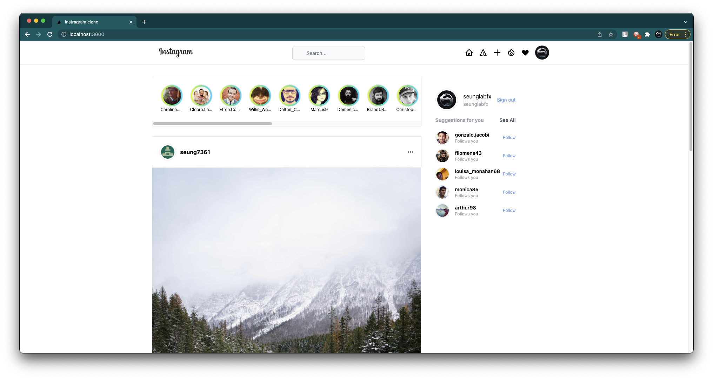

 

  

<h3 align="center">Instagram-clone</h3>

  

    <strike>description
     
    <a href="https://github.com/seung7361/instagram-clone"><strong>Explore the docs »</strong></a>
     
     
    <a href="">View Demo</a>
    ·
    <a href="https://github.com/seung7361/instagram-clone/issues">Report Bug</a>
    ·
    <a href="">Request Feature</a>
  
</strike>

  

## About this project & goals
### Introduction
This is a project where I follow along some tutorials by watching some videos on Youtube, reading some books and test some stuffs to create a fullstack application.
  

### Built With

* [Next.js](https://nextjs.org/)
* [React.js](https://reactjs.org/)
* [Recoil](https://recoiljs.org/ko/)
* [Tailwindcss](https://tailwindcss.com/)
* [Firebase](https://firebase.google.com/)
* [Typescript](https://www.typescriptlang.org/)
* [React-native](https://reactnative.dev/)

### Goals
> The biggest goal for this project is to make a fullstack application (including web app, android app, ios app, windows app) in some way or other. This is obviously not for commercial use, only for educational purposes.
### But why instagram?
> I had absolutely no idea what to make. I thought it would be easier to make instagram clone because there's a frame of what you can post.

### Milestone
+ <strike>Basic Frontend</strike>

+ Auth using OAuth (Google)
+ Fully working Web app
+ Fully working iOS/iPadOS app
+ Fully working Android app
+ Fully working Windows/Mac app

### License
Distributed under MIT license.